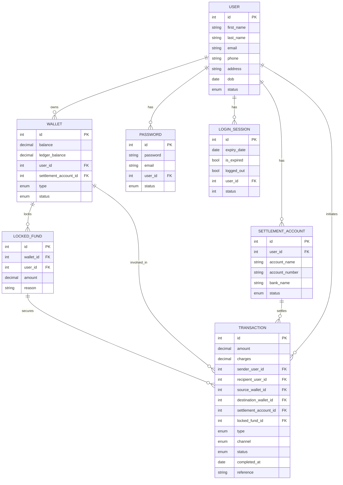

# Demo Credit

Demo Credit is a Node.js/TypeScript backend for a mobile lending app, providing wallet functionality for borrowers to receive loans and make repayments. This MVP supports user onboarding, wallet funding, transfers, withdrawals, and blacklist checks via the Lendsqr Adjutor Karma API.

## Features

- **User Onboarding:** Users can sign up and create accounts.
- **Wallet Funding:** Users can deposit money into their wallets.
- **Wallet Transfer:** Users can transfer funds to other users.
- **Wallet Withdrawal:** Users can withdraw funds from their wallets.
- **Blacklist Check:** Users on the Karma blacklist cannot be onboarded.

## Tech Stack

- Node.js, TypeScript
- Express.js
- MySQL (via Knex)
- Redis (for caching)
- JWT (authentication)
- Joi (validation)
- Jest (testing)

## Project Structure

- `src/` – Source code (controllers, services, repositories, entities, etc.)
  - `common/`
  - `controllers/`
  - `data/`
    - `entities/`
    - `enums/`
    - `interfaces/`
    - `migrations/`
  - `helpers/`
  - `middlewares/`
  - `repositories/`
  - `routes/`
  - `services/`
  - `types/`
  - `App.ts`
  - `index.ts`
  - `knexfile.ts`
- `tests/`

## Getting Started

1. **Install dependencies:**

   ```sh
   npm install
   ```

2. **Configure environment variables:**  
   Copy `.env.example` to `.env` and fill in your settings.

3. **Run database migrations:**

   ```sh
   npm run migrate:dev
   ```

4. **Start the server:**

   ```sh
   npm run dev
   ```

5. **Run tests:**
   ```sh
   npm test
   ```

## API Endpoints

- `POST /api/v1/auth/signup` – Create a new user account
- `POST /api/v1/auth/login` – Login and receive JWT
- `GET /api/v1/me` – Get the logged in user's profile
- `PATCH /api/v1/me/password` – Update user password
- `PATCH /api/v1/logout` – Get the logged in user's profile
- `PUT /api/v1/settlement-accounts` – Set settle account details
- `POST /api/v1/wallets/deposit` – Fund wallet
- `POST /api/v1/wallets/withdraw` – Withdraw from wallet
- `POST /api/v1/wallets/transfer` – Transfer funds to another user

## Entity Relationship Diagram (ERD)



## Blacklist Integration

During signup, the system checks the user's identity against the Karma blacklist API. If a record is found, onboarding is blocked.

## Testing

Tests are written using Jest and cover both positive and negative scenarios for wallet operations.  
Run tests with:

```sh
npm test
```

## License

ISC

---

**Author:** Goodness
